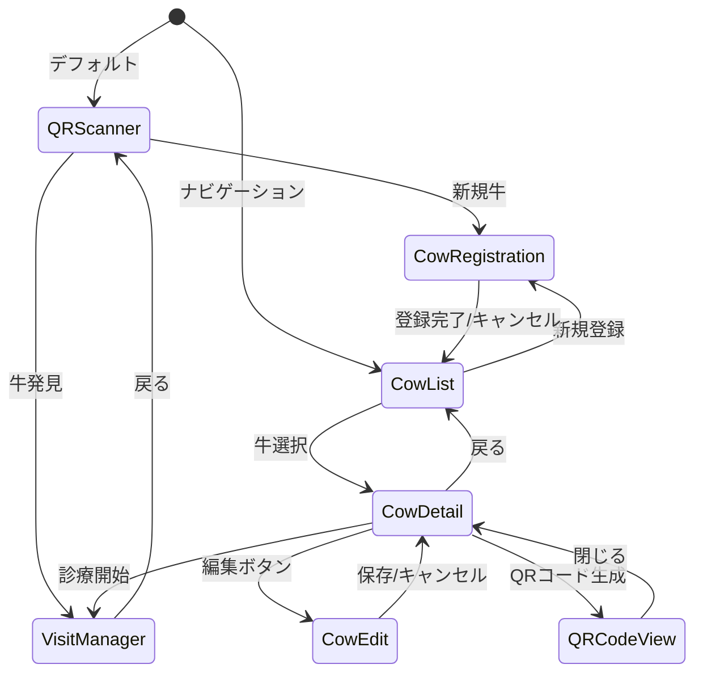

# 設計書: 牛管理・QRコード生成機能

## 概要

VetVoiceアプリケーションに牛の一覧管理機能とQRコード生成・印刷機能を追加する。現在はQRスキャン経由でのみ牛にアクセスできるが、本機能により牛一覧の閲覧・検索、新規登録、情報編集、QRコード生成・印刷が可能になる。

既存のAmplify Data（Cowモデル）とCowRegistrationFormコンポーネントを最大限再利用し、フロントエンドのみの変更で実装する。バックエンド（GraphQLスキーマ、Lambda関数等）の変更は不要。

### 設計判断

| 判断事項 | 決定 | 理由 |
|---------|------|------|
| QRコード生成ライブラリ | `qrcode` npm パッケージ | Canvas/SVG両対応、軽量、TypeScript型定義あり |
| ナビゲーション方式 | 既存のstate-based view switching拡張 | ルーターライブラリ導入はPoC段階では過剰 |
| 牛編集フォーム | CowRegistrationFormを `mode` propで拡張 | コード重複を避け、一貫したUI |
| 印刷機能 | `window.print()` + CSS `@media print` | PoC向けにシンプル、追加ライブラリ不要 |
| 検索フィルタ | クライアントサイドフィルタリング | 全件取得後にメモリ内で絞り込み（PoC規模では十分） |

## アーキテクチャ

### 画面遷移フロー



### AppView 状態拡張

既存の `AppView` 型を拡張し、牛管理画面を追加する:

```typescript
// 現在: type AppView = 'qr' | 'register' | 'visit_manager';
// 拡張後:
type AppView = 'qr' | 'register' | 'visit_manager' | 'cow_list';
```

`cow_list` ビュー内のサブナビゲーション（詳細、編集、QRコード表示）は `CowListScreen` コンポーネント内部で管理する。


## コンポーネントとインターフェース

### 新規コンポーネント

#### 1. CowListScreen

牛管理のメインコンテナ。内部でサブビュー（一覧、詳細、編集、QRコード）を管理する。

```typescript
// src/components/CowListScreen.tsx
type CowListView = 'list' | 'detail' | 'edit' | 'register';

interface CowListScreenProps {
  onNavigateToVisit: (cowId: string) => void;  // VisitManagerへの遷移
  onBack: () => void;                          // メイン画面に戻る
}
```

内部状態:
- `view: CowListView` — 現在のサブビュー
- `cows: CowData[]` — 取得した牛一覧
- `selectedCowId: string | null` — 選択中の牛ID
- `searchQuery: string` — 検索フィルタ文字列
- `loading: boolean` — データ取得中フラグ
- `error: string | null` — エラーメッセージ

#### 2. CowDetailView

牛の詳細情報表示。編集・QRコード生成・診療開始へのナビゲーションを提供する。

```typescript
// src/components/CowDetailView.tsx
interface CowDetailViewProps {
  cowId: string;
  onEdit: () => void;
  onGenerateQR: () => void;
  onStartVisit: (cowId: string) => void;
  onBack: () => void;
}
```

#### 3. CowEditForm（CowRegistrationForm拡張）

既存CowRegistrationFormを `mode` propで拡張し、編集モードをサポートする。

```typescript
// CowRegistrationForm.tsx を拡張
interface CowRegistrationFormProps {
  mode?: 'create' | 'edit';          // 新規追加（デフォルト: 'create'）
  initialCowId?: string;
  initialData?: Partial<FormState>;   // 新規追加: 編集時の初期値
  onRegistered: (cowId: string) => void;
  onCancel?: () => void;
}
```

編集モード時の動作:
- `cowId` フィールドを読み取り専用にする
- 送信時に `client.models.Cow.update()` を呼び出す
- ボタンテキストを「更新する」に変更

#### 4. QRCodeDisplay

QRコード生成・表示・印刷コンポーネント。

```typescript
// src/components/QRCodeDisplay.tsx
interface QRCodeDisplayProps {
  cowId: string;       // エンコードする個体識別番号
  onClose: () => void; // 閉じるボタン
}
```

### 既存コンポーネントの変更

#### App.tsx

- `AppView` 型に `'cow_list'` を追加
- ナビゲーションバーに「牛一覧」ボタンを追加
- `cow_list` ビュー時に `CowListScreen` をレンダリング

#### CowRegistrationForm.tsx

- `mode` prop を追加（デフォルト: `'create'`、後方互換性維持）
- `initialData` prop を追加（編集時の初期値）
- 編集モード時: cowIdを読み取り専用、`Cow.update()` を使用

### ユーティリティ関数

#### filterCows（検索フィルタロジック）

```typescript
// src/lib/cow-filter.ts
export function filterCows(cows: CowData[], query: string): CowData[] {
  if (!query.trim()) return cows;
  const normalizedQuery = query.trim().toLowerCase();
  return cows.filter((cow) =>
    cow.cowId.toLowerCase().includes(normalizedQuery) ||
    (cow.name?.toLowerCase().includes(normalizedQuery)) ||
    (cow.breed?.toLowerCase().includes(normalizedQuery)) ||
    (cow.farm?.toLowerCase().includes(normalizedQuery))
  );
}
```

検索対象フィールド: `cowId`（Individual_ID）、`name`、`breed`、`farm`。部分一致で絞り込む。


## データモデル

### 既存モデル（変更なし）

Amplify Data の `Cow` モデルをそのまま使用する。スキーマ変更は不要。

```typescript
// amplify/data/resource.ts（既存、変更なし）
Cow: a.model({
  cowId: a.string().required(),       // 個体識別番号（10桁、先頭0あり）
  earTagNo: a.string(),               // 耳標番号（任意）
  sex: a.ref('CowSex'),               // 性別（雌/雄/去勢）
  breed: a.string(),                  // 品種
  birthDate: a.date(),                // 生年月日
  parity: a.integer(),                // 産次/分娩回数（任意）
  lastCalvingDate: a.date(),          // 最終分娩日（任意）
  name: a.string(),                   // 牛の名前（任意）
  farm: a.string(),                   // 農場名（任意）
  createdAt: a.datetime(),
})
  .identifier(["cowId"])
  .authorization((allow) => [allow.authenticated()])
```

### フロントエンド型定義

Amplify Schemaから型を引き出す方針に従い、手書きの型定義は最小限にする。

```typescript
import { generateClient } from 'aws-amplify/data';
import type { Schema } from '../../amplify/data/resource';

const client = generateClient<Schema>();

// Cow モデルの型をSchemaから引き出す
type CowData = NonNullable<Awaited<ReturnType<typeof client.models.Cow.get>>['data']>;

// 一覧取得の型
type CowListResult = Awaited<ReturnType<typeof client.models.Cow.list>>;
```

### API操作

| 操作 | Amplify API | 用途 |
|------|------------|------|
| 全件取得 | `client.models.Cow.list()` | 牛一覧画面 |
| 個別取得 | `client.models.Cow.get({ cowId })` | 詳細画面 |
| 新規作成 | `client.models.Cow.create(data)` | 新規登録（既存フォーム） |
| 更新 | `client.models.Cow.update(data)` | 情報編集 |

### QRコード生成

`qrcode` ライブラリを使用し、フロントエンドのみでQRコードを生成する。

```typescript
import QRCode from 'qrcode';

// Canvas要素にQRコードを描画
async function generateQRCode(
  canvasElement: HTMLCanvasElement,
  cowId: string
): Promise<void> {
  await QRCode.toCanvas(canvasElement, cowId, {
    width: 256,
    margin: 2,
    errorCorrectionLevel: 'M',
  });
}
```

エンコード内容: `cowId`（個体識別番号の文字列そのもの）。既存のQRScannerは `decodedText.trim()` でcowIdを取得しているため、cowIdをそのままエンコードすれば互換性が保たれる。

### 印刷機能

CSS `@media print` とJavaScriptの `window.print()` を組み合わせる。

```css
@media print {
  /* QRコード表示エリア以外を非表示 */
  body > *:not(.qr-print-area) { display: none; }
  .qr-print-area {
    display: block;
    text-align: center;
    padding: 2rem;
  }
}
```

印刷時にはQRコード画像と個体識別番号テキストのみが出力される。


## 正当性プロパティ

*プロパティとは、システムのすべての有効な実行において成り立つべき特性や振る舞いのことである。人間が読める仕様と機械的に検証可能な正当性保証の橋渡しとなる。*

### Property 1: フィルタは一致する牛のみを返す

*任意の*牛リストと*任意の*非空検索クエリに対して、`filterCows` が返すすべての牛は、cowId・name・breed・farmのいずれかのフィールドにクエリ文字列を部分一致（大文字小文字無視）で含む。

**Validates: Requirements 2.2**

### Property 2: 空クエリはフィルタなし（恒等性）

*任意の*牛リストに対して、空文字列またはホワイトスペースのみのクエリで `filterCows` を呼び出した場合、元のリストと同一の結果を返す。

**Validates: Requirements 2.3**

### Property 3: フィルタ結果は元リストの部分集合

*任意の*牛リストと*任意の*検索クエリに対して、`filterCows` の結果の長さは元リストの長さ以下であり、結果に含まれるすべての牛は元リストにも含まれる。

**Validates: Requirements 2.2, 2.3**

### Property 4: QRコードラウンドトリップ

*任意の*有効なcowId（10桁数字文字列）に対して、`qrcode` ライブラリでエンコードした内容は元のcowId文字列と一致する。これにより既存のQRScannerとの互換性が保証される。

**Validates: Requirements 5.1, 5.5**

### Property 5: 編集フォーム初期値の一致

*任意の*牛データに対して、編集モードでCowRegistrationFormを初期化した場合、フォームの各フィールドの初期値は元の牛データの対応するフィールドと一致する。

**Validates: Requirements 4.2**


## エラーハンドリング

### データ取得エラー

| エラー種別 | 発生箇所 | 対応 |
|-----------|---------|------|
| ネットワークエラー | Cow.list() / Cow.get() | エラーメッセージ表示 + 再取得ボタン |
| GraphQLエラー | Cow.list() / Cow.get() | errors配列からメッセージ抽出して表示 |
| 認証エラー | 全API呼び出し | Amplify Authenticatorが自動処理 |

### データ更新エラー

| エラー種別 | 発生箇所 | 対応 |
|-----------|---------|------|
| バリデーションエラー | Cow.create() / Cow.update() | フォーム上にエラーメッセージ表示、入力内容保持 |
| 重複cowIdエラー | Cow.create() | 「この個体識別番号は既に登録されています」メッセージ |
| ネットワークエラー | Cow.create() / Cow.update() | エラーメッセージ表示、入力内容保持 |

### QRコード生成エラー

QRコード生成はフロントエンドのみで行うため、ネットワークエラーは発生しない。`qrcode` ライブラリのエラー（無効な入力等）は try-catch で捕捉し、エラーメッセージを表示する。cowIdは10桁数字のバリデーション済みのため、実質的にQR生成エラーは発生しない。

### エラー表示パターン

既存コンポーネント（VisitManager、CowRegistrationForm）と同じパターンを踏襲する:

```typescript
// Error alert pattern (consistent with existing components)
{error && (
  <div
    role="alert"
    style={{
      padding: '0.75rem',
      background: '#fff0f0',
      border: '1px solid #cc0000',
      borderRadius: '4px',
      color: '#cc0000',
      marginBottom: '1rem',
    }}
  >
    {error}
  </div>
)}
```

## テスト戦略

### テストライブラリ

- テストランナー: Vitest
- プロパティベーステスト: fast-check
- DOM環境: jsdom（Vitest設定済み）

### ユニットテスト

ユニットテストは具体的な例、エッジケース、エラー条件に焦点を当てる。

| テストファイル | テスト対象 | テスト内容 |
|--------------|-----------|-----------|
| `tests/unit/cow-filter.test.ts` | `filterCows` | 具体的な検索例、空リスト、空クエリ、大文字小文字 |
| `tests/unit/cow-list-screen.test.ts` | CowListScreen | ローディング表示、エラー表示、空リストメッセージ |
| `tests/unit/qr-code-display.test.ts` | QRCodeDisplay | QR生成呼び出し、印刷ボタン、cowIdテキスト表示 |

### プロパティベーステスト

プロパティベーステストは普遍的な性質を多数のランダム入力で検証する。各テストは最低100回実行する。

| テストファイル | プロパティ | 参照 |
|--------------|-----------|------|
| `tests/property/cow-filter.property.test.ts` | Property 1: フィルタ一致性 | Feature: cow-management-qr, Property 1 |
| `tests/property/cow-filter.property.test.ts` | Property 2: 空クエリ恒等性 | Feature: cow-management-qr, Property 2 |
| `tests/property/cow-filter.property.test.ts` | Property 3: 部分集合性 | Feature: cow-management-qr, Property 3 |
| `tests/property/qr-code.property.test.ts` | Property 4: QRラウンドトリップ | Feature: cow-management-qr, Property 4 |

Property 5（編集フォーム初期値）はReactコンポーネントの状態初期化に関するため、ユニットテストで具体例を検証する。

### fast-check ジェネレータ

```typescript
// tests/helpers/generators.ts に追加
import fc from 'fast-check';

// Valid cowId (10-digit numeric string, may start with 0)
export const cowIdArb = fc.stringOf(
  fc.constantFrom(...'0123456789'.split('')),
  { minLength: 10, maxLength: 10 }
);

// CowData arbitrary for property tests
export const cowDataArb = fc.record({
  cowId: cowIdArb,
  name: fc.option(fc.string({ minLength: 1, maxLength: 20 }), { nil: undefined }),
  breed: fc.option(fc.string({ minLength: 1, maxLength: 20 }), { nil: undefined }),
  farm: fc.option(fc.string({ minLength: 1, maxLength: 20 }), { nil: undefined }),
  earTagNo: fc.option(fc.string({ minLength: 1, maxLength: 10 }), { nil: undefined }),
  sex: fc.option(
    fc.constantFrom('FEMALE' as const, 'MALE' as const, 'CASTRATED' as const),
    { nil: undefined }
  ),
  birthDate: fc.option(
    fc.date().map((d) => d.toISOString().split('T')[0]),
    { nil: undefined }
  ),
  parity: fc.option(fc.nat({ max: 20 }), { nil: undefined }),
  lastCalvingDate: fc.option(
    fc.date().map((d) => d.toISOString().split('T')[0]),
    { nil: undefined }
  ),
});
```

### プロパティテストのタグ付け

各プロパティテストには設計書のプロパティを参照するコメントを付与する:

```typescript
// Feature: cow-management-qr, Property 1: Filter returns only matching cows
it('should only return cows matching the query', () => {
  fc.assert(
    fc.property(
      fc.array(cowDataArb),
      fc.string({ minLength: 1 }),
      (cows, query) => {
        const result = filterCows(cows, query);
        const normalizedQuery = query.trim().toLowerCase();
        if (!normalizedQuery) return true; // empty after trim -> returns all
        return result.every((cow) =>
          cow.cowId.toLowerCase().includes(normalizedQuery) ||
          (cow.name?.toLowerCase().includes(normalizedQuery) ?? false) ||
          (cow.breed?.toLowerCase().includes(normalizedQuery) ?? false) ||
          (cow.farm?.toLowerCase().includes(normalizedQuery) ?? false)
        );
      }
    ),
    { numRuns: 100 }
  );
});
```

### テスト方針まとめ

- ユニットテスト: 具体的なシナリオ、エッジケース（空リスト、エラー状態）、UI状態遷移
- プロパティテスト: `filterCows` の普遍的性質、QRコードラウンドトリップ
- プロパティテストにより過度なユニットテストの記述を避ける
- 各プロパティテストは最低100回のランダム入力で実行する
- 各テストにはコメントで設計書のプロパティ番号を参照する（タグ形式: `Feature: cow-management-qr, Property N: description`）

