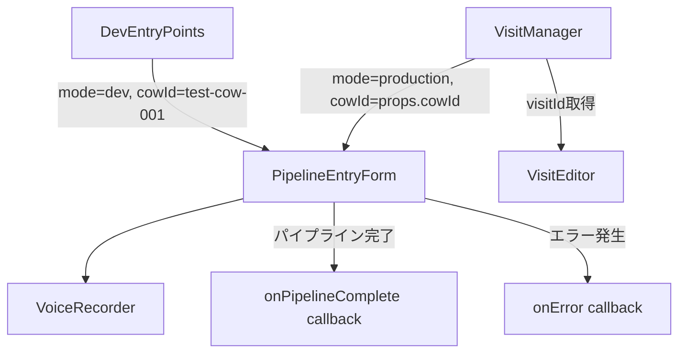
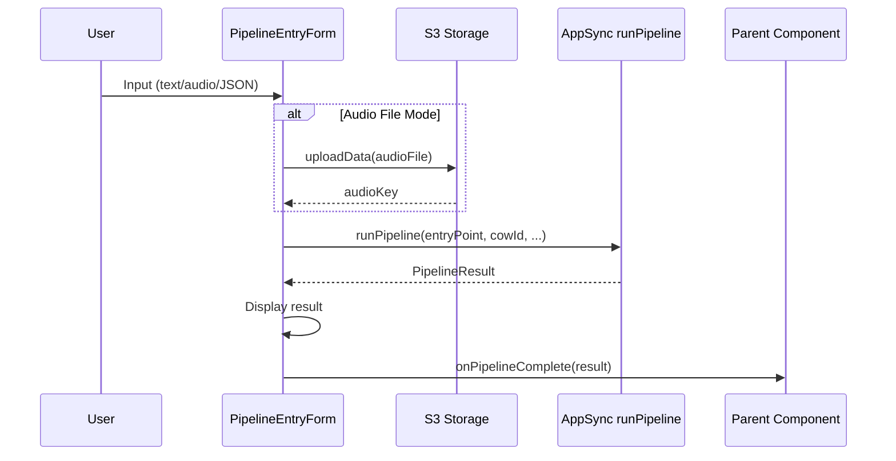

# 設計書: PipelineEntryForm

## 概要

PipelineEntryFormは、パイプライン実行UIを共通コンポーネントとして切り出すリファクタリングである。現在 `DevEntryPoints.tsx` に実装されている4モードタブUI（テキスト入力、音声ファイル、JSON入力、本番録音）のロジックを再利用可能な `PipelineEntryForm` コンポーネントに抽出し、`VisitManager.tsx` の「新規診療フォーム（実装予定）」プレースホルダーを実際のパイプライン実行UIに差し替える。

`PipelineEntryForm` は `mode` プロップ（`dev` / `production`）により表示タブを切り替える:
- `dev` モード: 全4タブ + 編集可能なcowId入力欄 + 結果表示
- `production` モード: 本番（録音）+ テキスト入力の2タブのみ + cowIdは非表示で親から受け取る

リファクタリング後、`DevEntryPoints` は `PipelineEntryForm` の薄いラッパーとなり、`VisitManager` は `new_visit` ビューで `PipelineEntryForm` を `production` モードで表示する。

## アーキテクチャ

### コンポーネント階層



### データフロー



### 設計判断

1. **共通コンポーネント抽出**: DevEntryPointsの既存ロジックをほぼそのまま `PipelineEntryForm` に移動し、`mode` プロップで表示制御を追加する。新規ロジックは最小限。
2. **結果表示の内包**: `PipelineEntryForm` 自体が結果表示（ResultField群）を内包する。親コンポーネントは `onPipelineComplete` コールバックで結果を受け取り、追加のアクション（VisitEditorへの遷移等）を行う。
3. **VoiceRecorderの再利用**: 既存の `VoiceRecorder` コンポーネントをそのまま利用。PipelineEntryFormは `onUploadComplete` を受けてパイプラインを呼び出す。

## コンポーネントとインターフェース

### PipelineEntryForm

新規作成: `src/components/PipelineEntryForm.tsx`

```typescript
interface PipelineResult {
  visitId: string;
  cowId: string;
  transcriptRaw?: string | null;
  transcriptExpanded?: string | null;
  extractedJson?: unknown;
  soapText?: string | null;
  kyosaiText?: string | null;
  templateType?: string | null;
  warnings?: (string | null)[] | null;
}

type FormMode = 'dev' | 'production';

interface PipelineEntryFormProps {
  cowId: string;
  mode: FormMode;
  onPipelineComplete?: (result: PipelineResult) => void;
  onError?: (errorMessage: string) => void;
}
```

**責務:**
- 入力モードタブの表示制御（`mode` に応じたタブフィルタリング）
- 各入力モードのフォームUI（テキスト入力、音声ファイル、JSON入力、本番録音）
- バリデーション（空入力、JSON構文エラー）
- S3アップロード（音声ファイルモード）
- `runPipeline` GraphQLクエリの呼び出し
- 実行状態管理（loading、error、result）
- 結果表示（ResultField群）
- コールバック呼び出し（`onPipelineComplete`、`onError`）

**タブ表示ロジック:**
- `dev` モード: `['TEXT_INPUT', 'AUDIO_FILE', 'JSON_INPUT', 'PRODUCTION']`
- `production` モード: `['PRODUCTION', 'TEXT_INPUT']`

**cowId制御:**
- `dev` モード: 編集可能な入力欄を表示、初期値は `cowId` プロップ
- `production` モード: 入力欄非表示、`cowId` プロップをそのまま使用

### DevEntryPoints（リファクタリング後）

既存ファイル: `src/components/DevEntryPoints.tsx`

```typescript
export function DevEntryPoints() {
  return (
    <div className="dev-entry-points">
      <h2>開発用エントリポイント</h2>
      <PipelineEntryForm
        cowId="test-cow-001"
        mode="dev"
      />
    </div>
  );
}
```

リファクタリング後は `PipelineEntryForm` のラッパーとなり、見出しテキストのみを保持する。

### VisitManager（統合後）

既存ファイル: `src/components/VisitManager.tsx`

`new_visit` ビューのプレースホルダーを `PipelineEntryForm` に差し替え:

```typescript
// new_visit view
<PipelineEntryForm
  cowId={cowId}
  mode="production"
  onPipelineComplete={(result) => {
    setSelectedVisitId(result.visitId);
    setView('visit_detail');
  }}
  onError={(msg) => setError(msg)}
/>
```

パイプライン完了時に `result.visitId` を取得し、`VisitEditor` に遷移する。

### VoiceRecorder（変更なし）

既存ファイル: `src/components/VoiceRecorder.tsx`

```typescript
interface VoiceRecorderProps {
  cowId: string;
  onUploadComplete: (audioKey: string) => void;
  onError?: (error: string) => void;
}
```

PipelineEntryFormから呼び出される。インターフェース変更なし。

## データモデル

### PipelineResult型

`runPipeline` GraphQLクエリの戻り値。既存の `PipelineOutput` カスタム型と対応する。

```typescript
interface PipelineResult {
  visitId: string;       // 作成されたVisitのID
  cowId: string;         // 対象牛のID
  transcriptRaw?: string | null;       // 文字起こし（raw）
  transcriptExpanded?: string | null;  // 文字起こし（辞書展開後）
  extractedJson?: unknown;             // 構造化JSON（a.json()型）
  soapText?: string | null;            // SOAPテキスト
  kyosaiText?: string | null;          // 家畜共済テキスト
  templateType?: string | null;        // テンプレートタイプ
  warnings?: (string | null)[] | null; // 警告メッセージ配列
}
```

### TabMode型

入力モードを表す列挙型。GraphQLスキーマの `entryPoint` 引数と一致する。

```typescript
type TabMode = 'TEXT_INPUT' | 'AUDIO_FILE' | 'JSON_INPUT' | 'PRODUCTION';
```

### FormMode型

PipelineEntryFormの表示モード。

```typescript
type FormMode = 'dev' | 'production';
```

### タブ表示マッピング

```typescript
const TABS_BY_MODE: Record<FormMode, TabMode[]> = {
  dev: ['TEXT_INPUT', 'AUDIO_FILE', 'JSON_INPUT', 'PRODUCTION'],
  production: ['PRODUCTION', 'TEXT_INPUT'],
};

const TAB_LABELS: Record<TabMode, string> = {
  TEXT_INPUT: 'テキスト入力',
  AUDIO_FILE: '音声ファイル',
  JSON_INPUT: 'JSON入力',
  PRODUCTION: '本番（録音）',
};
```

### 内部状態

PipelineEntryFormの内部状態は既存DevEntryPointsと同等:

| 状態 | 型 | 説明 |
|------|-----|------|
| activeTab | TabMode | 現在選択中のタブ |
| effectiveCowId | string | 実際に使用するcowId（devモードでは編集可能） |
| loading | boolean | パイプライン実行中フラグ |
| error | string \| null | エラーメッセージ |
| result | PipelineResult \| null | 実行結果 |
| transcriptText | string | テキスト入力タブの入力値 |
| audioFile | File \| null | 音声ファイルタブの選択ファイル |
| uploadStatus | string \| null | アップロード状態メッセージ |
| jsonText | string | JSON入力タブの入力値 |


## 正当性プロパティ (Correctness Properties)

*プロパティとは、システムのすべての有効な実行において成り立つべき特性や振る舞いのことである。プロパティは、人間が読める仕様と機械的に検証可能な正当性保証の橋渡しとなる。*

### Property 1: モードによるタブ表示制御

*For any* `FormMode` value (`dev` or `production`), the set of displayed tabs must exactly match the expected tab set for that mode: `dev` → `['TEXT_INPUT', 'AUDIO_FILE', 'JSON_INPUT', 'PRODUCTION']`, `production` → `['PRODUCTION', 'TEXT_INPUT']`.

**Validates: Requirements 1.2, 1.5, 1.7**

### Property 2: 非空テキスト入力のパイプライン呼び出し

*For any* non-empty, non-whitespace-only transcript text string and any cowId, submitting the text input tab shall call `runPipeline` with `entryPoint: 'TEXT_INPUT'`, the current `cowId`, and the entered `transcriptText`.

**Validates: Requirements 2.2**

### Property 3: 空白テキストのバリデーション拒否

*For any* string composed entirely of whitespace characters (including empty string), submitting the text input tab shall be rejected with a validation error, and `runPipeline` shall not be called.

**Validates: Requirements 2.3**

### Property 4: 音声ファイルメタデータ表示

*For any* selected audio file with a name and size, the component shall display both the file name and the file size in the UI.

**Validates: Requirements 3.2**

### Property 5: 有効JSONのパイプライン呼び出し

*For any* valid JSON string, submitting the JSON input tab shall call `runPipeline` with `entryPoint: 'JSON_INPUT'` and the parsed JSON object as `extractedJson`.

**Validates: Requirements 4.2**

### Property 6: 無効JSONのパースエラー表示

*For any* string that is not valid JSON syntax (and is non-empty), submitting the JSON input tab shall display a JSON parse error message, and `runPipeline` shall not be called.

**Validates: Requirements 4.4**

### Property 7: GraphQLエラーの表示とコールバック

*For any* array of GraphQL error messages returned from `runPipeline`, the component shall display all error messages and invoke the `onError` callback with the concatenated error text.

**Validates: Requirements 6.3**

### Property 8: 結果フィールドの完全表示

*For any* `PipelineResult` object, every non-null field (`visitId`, `cowId`, `templateType`, `transcriptRaw`, `transcriptExpanded`, `extractedJson`, `soapText`, `kyosaiText`, `warnings`) shall appear in the rendered output.

**Validates: Requirements 7.1, 7.2, 7.3, 7.4, 7.5, 7.6, 7.7**

## エラーハンドリング

### バリデーションエラー

| 入力モード | エラー条件 | エラーメッセージ |
|-----------|-----------|----------------|
| テキスト入力 | 空文字列またはホワイトスペースのみ | 「診療テキストを入力してください。」 |
| 音声ファイル | ファイル未選択 | 「音声ファイルを選択してください。」 |
| JSON入力 | 空文字列 | 「ExtractedJSONを入力してください。」 |
| JSON入力 | JSON構文エラー | 「JSONの形式が正しくありません。」 |

### パイプライン実行エラー

| エラー種別 | 処理 |
|-----------|------|
| GraphQLエラー（`errors` 配列） | エラーメッセージを連結して表示 + `onError` コールバック呼び出し |
| ネットワークエラー（`catch` ブロック） | `Error.message` または汎用メッセージ表示 + `onError` コールバック呼び出し |
| S3アップロードエラー | `Error.message` または汎用メッセージ表示 + `onError` コールバック呼び出し |

### エラー表示

- エラーメッセージは `role="alert"` 属性付きの赤色ボーダーボックスで表示
- タブ切り替え時にエラーと結果をリセット
- 新しいパイプライン実行開始時にエラーと結果をリセット

## テスト戦略

### テストフレームワーク

- ユニットテスト: Vitest + React Testing Library
- プロパティベーステスト: fast-check
- テストファイル配置:
  - ユニットテスト: `tests/unit/pipeline-entry-form.test.tsx`
  - プロパティテスト: `tests/property/pipeline-entry-form.property.test.tsx`

### ユニットテスト（具体例・エッジケース）

| テスト対象 | テスト内容 | 対応要件 |
|-----------|-----------|---------|
| PipelineEntryForm | devモードでcowId入力欄が表示される | 1.6 |
| PipelineEntryForm | productionモードでcowId入力欄が非表示 | 1.8 |
| PipelineEntryForm | onPipelineCompleteコールバックが成功時に呼ばれる | 1.3, 6.2 |
| PipelineEntryForm | onErrorコールバックがエラー時に呼ばれる | 1.4, 6.4 |
| PipelineEntryForm | 音声ファイル未選択でバリデーションエラー | 3.4 |
| PipelineEntryForm | 空JSON入力でバリデーションエラー | 4.3 |
| PipelineEntryForm | VoiceRecorderが本番タブに表示される | 5.1 |
| PipelineEntryForm | VoiceRecorder完了時にrunPipelineが呼ばれる | 5.2 |
| PipelineEntryForm | VoiceRecorderエラーが表示される | 5.3 |
| PipelineEntryForm | 実行中にボタンが無効化される | 6.1 |
| PipelineEntryForm | アップロード中にステータス表示 | 3.5 |
| DevEntryPoints | mode=devでPipelineEntryFormをレンダリング | 8.1 |
| DevEntryPoints | cowId=test-cow-001を渡す | 8.2 |
| DevEntryPoints | 見出しテキストが保持される | 8.3 |
| VisitManager | 新規診療ボタンでPipelineEntryFormが表示される | 9.1 |
| VisitManager | パイプライン完了時にVisitEditorに遷移 | 9.2 |
| VisitManager | 戻るボタンで一覧に戻る | 9.3 |
| VisitManager | プレースホルダーが置き換えられている | 9.4 |

### プロパティベーステスト

各プロパティテストは最低100回のイテレーションで実行する。各テストにはデザインドキュメントのプロパティ番号をタグとしてコメントに記載する。

タグ形式: `Feature: pipeline-entry-form, Property {number}: {property_text}`

| Property | テスト内容 | ジェネレータ |
|----------|-----------|------------|
| Property 1 | モードによるタブ表示制御 | `fc.constantFrom('dev', 'production')` |
| Property 2 | 非空テキスト入力のパイプライン呼び出し | `fc.string().filter(s => s.trim().length > 0)` + `fc.string()` (cowId) |
| Property 3 | 空白テキストのバリデーション拒否 | `fc.stringOf(fc.constantFrom(' ', '\t', '\n', '\r'))` |
| Property 4 | 音声ファイルメタデータ表示 | `fc.record({ name: fc.string(), size: fc.nat() })` |
| Property 5 | 有効JSONのパイプライン呼び出し | `fc.jsonValue()` |
| Property 6 | 無効JSONのパースエラー表示 | `fc.string().filter(s => { try { JSON.parse(s); return false; } catch { return true; } }).filter(s => s.trim().length > 0)` |
| Property 7 | GraphQLエラーの表示とコールバック | `fc.array(fc.record({ message: fc.string() }), { minLength: 1 })` |
| Property 8 | 結果フィールドの完全表示 | `pipelineResultArb` (カスタムジェネレータ) |

### カスタムジェネレータ

`tests/helpers/generators.ts` に以下のジェネレータを追加:

```typescript
// PipelineResult arbitrary
export const pipelineResultArb = fc.record({
  visitId: fc.string({ minLength: 1 }),
  cowId: fc.string({ minLength: 1 }),
  transcriptRaw: fc.option(fc.string(), { nil: null }),
  transcriptExpanded: fc.option(fc.string(), { nil: null }),
  extractedJson: fc.option(fc.jsonValue(), { nil: null }),
  soapText: fc.option(fc.string(), { nil: null }),
  kyosaiText: fc.option(fc.string(), { nil: null }),
  templateType: fc.option(fc.string(), { nil: null }),
  warnings: fc.option(
    fc.array(fc.option(fc.string(), { nil: null })),
    { nil: null }
  ),
});
```

### テスト方針

- **ユニットテスト**: 具体的なUI動作、エッジケース、統合ポイント（DevEntryPoints/VisitManagerとの連携）を検証
- **プロパティテスト**: 入力バリデーション、タブ表示制御、結果表示の普遍的な性質を検証
- **モック**: `aws-amplify/data` の `generateClient` と `aws-amplify/storage` の `uploadData` をモック化
- 各プロパティテストは1つの正当性プロパティに対応する単一のテストとして実装する
