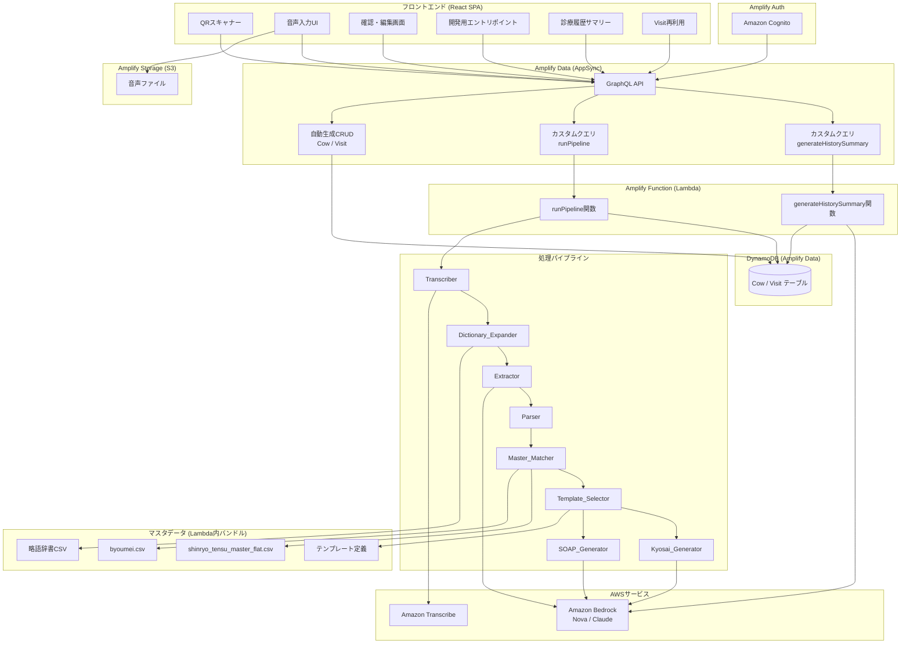
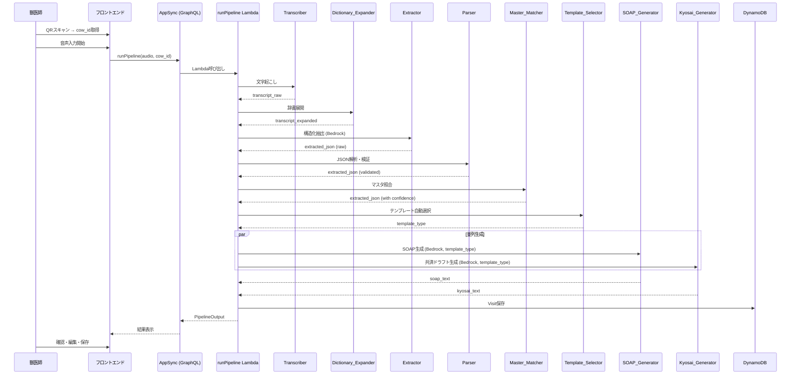
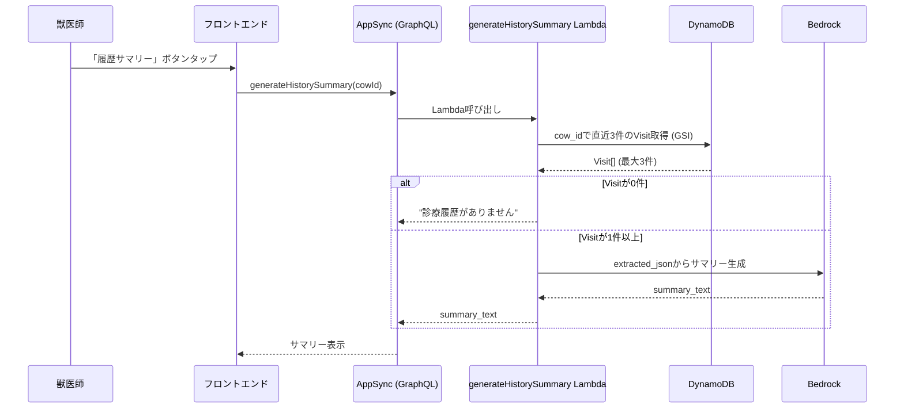
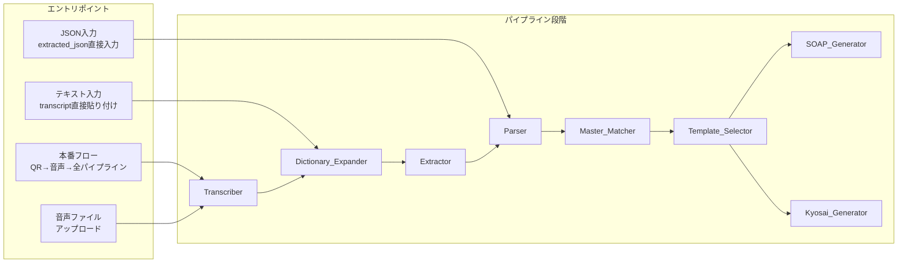

# 設計書: 獣医音声診療記録システム (VetVoice)

## 概要

本システムは、大動物（牛）を診療する獣医師がスマートフォンで音声入力により診療記録を作成するPoCである。QRコードで牛を特定し、音声→テキスト→構造化JSON→SOAP/家畜共済ドラフトのパイプラインを実行する。

設計原則「JSONを正にして、SOAP/共済は派生」に基づき、`transcript_raw`と`extracted_json`をSource of Truthとして保存し、SOAPサマリーおよび家畜共済記録はオンデマンドで再生成可能な派生出力として扱う。

### インフラストラクチャ: AWS Amplify Gen 2

本システムはAWS Amplify Gen 2をインフラ基盤として採用する。Amplify Gen 2はTypeScriptベースのコード定義（CDK）でバックエンドリソースを宣言的に構築でき、PoCの迅速な開発に適している。

リージョン: **us-east-1（バージニア北部）** — モデル選択肢最多、コスト最適、コンペティション向き。

### コンペティション制約 (AWS 10000 AIdeas)

| 制約 | 内容 |
|------|------|
| 予算 | AWS無料利用枠 + 最大$200クレジット |
| 必須ツール | Kiro（開発の一部に使用） |
| 推奨サービス | Amazon Bedrock, Amazon Nova, Bedrock AgentCore, Strands Agents |
| 審査基準 | 革新性、効率性、実用的インパクト（計算規模ではない） |
| 成果物 | Builder Centerに記事公開（概要、重要性、AWSサービス、デモ） |

#### 無料利用枠の活用

| サービス | 無料枠 | 本システムでの使用量見込み |
|---------|--------|------------------------|
| Amazon Transcribe | 月60分（12ヶ月） | PoC: 月10-20分程度 ✅ |
| Amazon Bedrock (Nova Micro) | 従量課金（$200クレジット内） | 低コスト、PoC十分 ✅ |
| Amazon Bedrock (Nova Lite) | 従量課金（$200クレジット内） | 低コスト、PoC十分 ✅ |
| Amazon Bedrock (Nova Pro) | 従量課金（$200クレジット内） | 抽出処理のみ、PoC十分 ✅ |
| DynamoDB | 25GB + 読み書きキャパシティ無料 | PoC: 数MB程度 ✅ |
| Amplify Hosting | ビルド月1000分、ホスティング月15GB | PoC十分 ✅ |
| Amplify Auth (Cognito) | MAU 10,000無料 | PoC: テストユーザー数名 ✅ |
| S3 | 5GB無料 | 音声ファイル保存、PoC十分 ✅ |
| Lambda | 月100万リクエスト + 40万GB秒無料 | PoC十分 ✅ |
| AppSync | 月25万クエリ無料（12ヶ月） | PoC十分 ✅ |

### 主要な設計判断

| 判断 | 選択 | 理由 |
|------|------|------|
| リージョン | us-east-1（バージニア北部） | モデル選択肢最多、コスト最適、コンペ向き |
| インフラ基盤 | AWS Amplify Gen 2 | TypeScriptベースのコード定義、CI/CD統合、PoC向き |
| APIレイヤー | AppSync (Amplify Data) | GraphQLカスタムクエリ、組み込み認証 |
| AIパイプライン | Amplify Function (Lambda) | カスタムビジネスロジック、Bedrock統合 |
| データストア | DynamoDB via Amplify Data | スキーマ駆動、自動CRUD生成 |
| 認証 | Amplify Auth (Cognito) | 組み込み認証、PoC用テストユーザー容易 |
| ホスティング | Amplify Hosting | CI/CD、カスタムドメイン対応 |
| 音声ストレージ | Amplify Storage (S3) | 音声ファイルアップロード用 |
| 音声認識 | Amazon Transcribe (日本語) | 日本語対応。Nova Sonicは日本語非対応のため不採用 |
| LLMプロバイダ | Amazon Bedrock | マネージドサービス、複数モデル切替可能 |
| LLMモデル（デフォルト） | Amazon Nova (Micro/Lite/Pro) | コンペ推奨、低コスト、200言語対応（日本語含む） |
| LLMモデル（フォールバック） | Anthropic Claude (Haiku/Sonnet) | Nova精度不足時の切替先 |
| モデル選択方式 | コンポーネント別設定 | 機能ごとにコスト/精度のバランスを最適化 |
| Dictionary_Expander | ルールベース辞書ルックアップ | 決定論的動作。LLM不要 |
| Master_Matcher | ファジー文字列マッチング | 決定論的・高速。LLM不要 |
| フロントエンド | React + TypeScript (モバイルファースト) | 牛舎での利用を想定したレスポンシブSPA |
| オフライン対応 | カスタムキュー＆リトライ (localStorage) | Web SPAではlocalStorageベースのカスタムキュー |

### モデル設定レイヤー

LLMを利用するコンポーネント（Extractor、SOAP_Generator、Kyosai_Generator、HistorySummary）ごとに、使用するモデルを個別に設定可能とする。デフォルトはAmazon Nova（コンペ推奨）、精度不足時にClaudeへフォールバックできる設計とする。

```typescript
// amplify/data/handlers/model-config.ts

interface ModelConfig {
  modelId: string;
  region: string;
  maxTokens: number;
  temperature: number;
}

interface PipelineModelConfig {
  extractor: ModelConfig;
  soapGenerator: ModelConfig;
  kyosaiGenerator: ModelConfig;
  historySummary: ModelConfig;
}

// Default: Amazon Nova (competition recommended)
const DEFAULT_MODEL_CONFIG: PipelineModelConfig = {
  extractor: {
    modelId: "amazon.nova-pro-v1:0",      // 高精度抽出
    region: "us-east-1",
    maxTokens: 4096,
    temperature: 0.1,
  },
  soapGenerator: {
    modelId: "amazon.nova-lite-v1:0",     // 低コスト生成
    region: "us-east-1",
    maxTokens: 2048,
    temperature: 0.3,
  },
  kyosaiGenerator: {
    modelId: "amazon.nova-lite-v1:0",     // 低コスト生成
    region: "us-east-1",
    maxTokens: 2048,
    temperature: 0.2,
  },
  historySummary: {
    modelId: "amazon.nova-micro-v1:0",    // 最低コスト
    region: "us-east-1",
    maxTokens: 1024,
    temperature: 0.3,
  },
};

// Fallback: Claude (if Nova accuracy is insufficient)
const CLAUDE_FALLBACK_CONFIG: Partial<PipelineModelConfig> = {
  extractor: {
    modelId: "anthropic.claude-3-haiku-20240307-v1:0",
    region: "us-east-1",
    maxTokens: 4096,
    temperature: 0.1,
  },
  // Other components can be individually overridden
};

function getModelConfig(component: keyof PipelineModelConfig): ModelConfig {
  // Read from environment variable or config file
  // Allows per-component model override
}
```

Non-LLMコンポーネント（Dictionary_Expander: ルールベース辞書ルックアップ、Master_Matcher: ファジー文字列マッチング）はモデル設定の対象外。

## アーキテクチャ

### システム全体構成



### パイプラインフロー



### 診療履歴サマリーフロー



### 開発用エントリポイント

パイプラインは段階的に処理を実行するため、開発・デバッグ時に任意の段階から開始できるエントリポイントを提供する。



各エントリポイントは、スキップされた段階以降のパイプライン処理を本番フローと同一のロジックで実行する。

### Amplifyプロジェクト構成

```
amplify/
├── auth/
│   └── resource.ts              # Amplify Auth (Cognito) 定義
├── data/
│   ├── resource.ts              # Amplify Data スキーマ + カスタムクエリ定義
│   ├── run-pipeline.ts          # AIパイプライン Lambda関数
│   ├── generate-history-summary.ts  # 診療履歴サマリー Lambda関数
│   └── handlers/
│       ├── model-config.ts       # コンポーネント別モデル設定
│       ├── transcriber.ts       # Amazon Transcribe連携
│       ├── dictionary-expander.ts   # 略語辞書展開（ルールベース）
│       ├── extractor.ts         # Bedrock構造化抽出
│       ├── parser.ts            # JSON解析・検証
│       ├── master-matcher.ts    # マスタデータ照合（ファジーマッチ）
│       ├── template-selector.ts # テンプレート自動選択
│       ├── soap-generator.ts    # Bedrock SOAP生成
│       └── kyosai-generator.ts  # Bedrock共済ドラフト生成
├── storage/
│   └── resource.ts              # Amplify Storage (S3) 定義
└── backend.ts                   # バックエンド定義（auth + data + storage統合）
src/
├── components/
│   ├── QRScanner.tsx            # QRコードスキャナー
│   ├── CowRegistrationForm.tsx  # 牛の新規登録フォーム
│   ├── VoiceRecorder.tsx        # 音声入力UI
│   ├── VisitEditor.tsx          # 確認・編集画面
│   ├── SOAPView.tsx             # SOAPサマリー表示
│   ├── KyosaiView.tsx           # 家畜共済ドラフト表示
│   ├── HistorySummary.tsx       # 診療履歴サマリー
│   ├── TemplateSelector.tsx     # テンプレート手動選択UI
│   ├── VisitReuse.tsx           # Visit再利用UI
│   └── DevEntryPoints.tsx       # 開発用エントリポイント
├── lib/
│   ├── offline-queue.ts         # オフラインキュー＆リトライ
│   ├── visit-reuse.ts           # Visit再利用ロジック
│   └── templates.ts             # テンプレート定義
└── App.tsx
assets/
├── byoumei.csv
├── shinryo_tensu_master_flat.csv
├── shinryo_betsu_snow_regions.csv
└── dictionary.csv               # 略語辞書（1正式名称に複数略語対応）
```

## コンポーネントとインターフェース

### Amplify バックエンド定義

#### Auth (amplify/auth/resource.ts)

```typescript
import { defineAuth } from "@aws-amplify/backend";

export const auth = defineAuth({
  loginWith: {
    email: true,
  },
  // PoC用: テストユーザーを手動でCognitoコンソールから作成
});
```

#### Storage (amplify/storage/resource.ts)

```typescript
import { defineStorage } from "@aws-amplify/backend";

export const storage = defineStorage({
  name: "vetVoiceAudio",
  access: (allow) => ({
    "audio/{entity_id}/*": [
      allow.entity("identity").to(["read", "write", "delete"]),
    ],
  }),
});
```

#### Data スキーマ (amplify/data/resource.ts)

```typescript
import { type ClientSchema, a, defineData, defineFunction } from "@aws-amplify/backend";

// Lambda関数定義
const runPipelineFunction = defineFunction({
  name: "runPipeline",
  entry: "./run-pipeline.ts",
  timeoutSeconds: 120,  // パイプライン全体の処理時間を考慮
  memoryMB: 512,
});

const generateHistorySummaryFunction = defineFunction({
  name: "generateHistorySummary",
  entry: "./generate-history-summary.ts",
  timeoutSeconds: 30,
  memoryMB: 256,
});

const schema = a.schema({
  // --- Enum定義 ---
  CowSex: a.enum(['FEMALE', 'MALE', 'CASTRATED']),

  // --- モデル定義 ---
  Cow: a.model({
    cowId: a.string().required(),       // 個体識別番号（10桁、先頭0あり）
    earTagNo: a.string(),               // 耳標番号（任意）
    sex: a.ref('CowSex'),              // 性別（雌/雄/去勢）
    breed: a.string(),                  // 品種
    birthDate: a.date(),                // 生年月日
    parity: a.integer(),                // 産次/分娩回数（任意）
    lastCalvingDate: a.date(),          // 最終分娩日（任意）
    name: a.string(),                   // 牛の名前（任意）
    farm: a.string(),                   // 農場名（任意）
    createdAt: a.datetime(),
  })
    .identifier(["cowId"])
    .authorization((allow) => [allow.authenticated()]),

  Visit: a.model({
    visitId: a.string().required(),
    cowId: a.string().required(),
    datetime: a.datetime().required(),
    status: a.enum(["IN_PROGRESS", "COMPLETED"]),
    transcriptRaw: a.string(),
    transcriptExpanded: a.string(),
    extractedJson: a.json(),
    soapText: a.string(),
    kyosaiText: a.string(),
    templateType: a.string(),       // 要件16: テンプレートタイプ
    updatedAt: a.datetime(),
  })
    .identifier(["visitId"])
    .secondaryIndexes((index) => [
      index("cowId").sortKeys(["datetime"]).queryField("listVisitsByCow"),
    ])
    .authorization((allow) => [allow.authenticated()]),

  // --- カスタム型定義 ---
  PipelineOutput: a.customType({
    visitId: a.string().required(),
    cowId: a.string().required(),
    transcriptRaw: a.string(),
    transcriptExpanded: a.string(),
    extractedJson: a.json(),
    soapText: a.string(),
    kyosaiText: a.string(),
    templateType: a.string(),
    warnings: a.string().array(),
  }),

  // --- カスタムクエリ ---
  runPipeline: a.query()
    .arguments({
      entryPoint: a.enum(["PRODUCTION", "TEXT_INPUT", "AUDIO_FILE", "JSON_INPUT"]),
      cowId: a.string().required(),
      audioKey: a.string(),           // S3キー（音声ファイル）
      transcriptText: a.string(),     // テキスト直接入力
      extractedJson: a.json(),        // JSON直接入力
      templateType: a.string(),       // 手動テンプレート指定（任意）
    })
    .returns(a.ref("PipelineOutput"))
    .handler(a.handler.function(runPipelineFunction))
    .authorization((allow) => [allow.authenticated()]),

  generateHistorySummary: a.query()
    .arguments({
      cowId: a.string().required(),
    })
    .returns(a.string())
    .handler(a.handler.function(generateHistorySummaryFunction))
    .authorization((allow) => [allow.authenticated()]),
});

export type Schema = ClientSchema<typeof schema>;
export const data = defineData({
  schema,
  authorizationModes: {
    defaultAuthorizationMode: "userPool",
  },
});
```

#### Backend統合 (amplify/backend.ts)

```typescript
import { defineBackend } from "@aws-amplify/backend";
import { Effect, PolicyStatement } from "aws-cdk-lib/aws-iam";
import { auth } from "./auth/resource";
import { data } from "./data/resource";
import { storage } from "./storage/resource";

const backend = defineBackend({
  auth,
  data,
  storage,
});

// Bedrock権限をLambda関数に付与
const bedrockPolicy = new PolicyStatement({
  effect: Effect.ALLOW,
  actions: ["bedrock:InvokeModel"],
  resources: [
    // Amazon Nova models (default)
    "arn:aws:bedrock:us-east-1::foundation-model/amazon.nova-micro-v1:0",
    "arn:aws:bedrock:us-east-1::foundation-model/amazon.nova-lite-v1:0",
    "arn:aws:bedrock:us-east-1::foundation-model/amazon.nova-pro-v1:0",
    // Claude models (fallback)
    "arn:aws:bedrock:us-east-1::foundation-model/anthropic.claude-3-haiku-*",
    "arn:aws:bedrock:us-east-1::foundation-model/anthropic.claude-3-sonnet-*",
  ],
});

// Transcribe権限をrunPipeline関数に付与
const transcribePolicy = new PolicyStatement({
  effect: Effect.ALLOW,
  actions: [
    "transcribe:StartStreamTranscription",
    "transcribe:StartTranscriptionJob",
    "transcribe:GetTranscriptionJob",
  ],
  resources: ["*"],
});

// S3読み取り権限（音声ファイル取得用）
const s3ReadPolicy = new PolicyStatement({
  effect: Effect.ALLOW,
  actions: ["s3:GetObject"],
  resources: [
    backend.storage.resources.bucket.bucketArn + "/audio/*",
  ],
});

// runPipeline関数にポリシー付与
const runPipelineLambda = backend.data.resources.functions["runPipeline"];
runPipelineLambda.addToRolePolicy(bedrockPolicy);
runPipelineLambda.addToRolePolicy(transcribePolicy);
runPipelineLambda.addToRolePolicy(s3ReadPolicy);

// generateHistorySummary関数にBedrock権限付与
const historySummaryLambda = backend.data.resources.functions["generateHistorySummary"];
historySummaryLambda.addToRolePolicy(bedrockPolicy);
```

### パイプラインコンポーネント

以下のコンポーネントはAmplify Function (Lambda) 内で実行される。AIパイプラインのロジック自体は変更なし。

### 1. Scanner (QRコードスキャナー)

フロントエンド側コンポーネント。スマートフォンのカメラでQRコードを読み取り、`cow_id`を取得する。

```typescript
// フロントエンド側
interface ScanResult {
  success: boolean;
  cow_id?: string;
  error?: string;
}

function scanQRCode(): Promise<ScanResult>;
```

- ライブラリ: `html5-qrcode` または同等のWebベースQRリーダー
- エラー時: 再スキャン促進のUIフィードバック
- 牛情報取得: Amplify Data自動生成の`getCow(cowId)`を使用
- cow_id不存在時: 新規牛登録画面へ遷移（cow_idを自動入力）

### 2. Transcriber (音声文字起こし)

Amazon Transcribe APIを利用し、日本語音声をテキスト変換する。Lambda内で実行。

```typescript
interface TranscribeInput {
  audioKey: string;       // S3上の音声ファイルキー
  language: "ja-JP";
}

interface TranscribeOutput {
  transcript_raw: string;
  confidence: number;
}

async function transcribe(input: TranscribeInput): Promise<TranscribeOutput>;
```

- カスタム語彙: 畜産・獣医学用語を登録
- 音声ファイルはAmplify Storage (S3) にアップロード済み前提

### 3. Dictionary_Expander (辞書展開)

ルールベースの辞書ルックアップ。LLMは使用しない。

```typescript
interface DictionaryEntry {
  canonical: string;          // 正式名称 (例: "静脈注射")
  abbreviations: string[];    // 略語・同義語リスト (例: ["静注", "IV", "静脈内注射"])
  category?: string;          // カテゴリ (例: "投与経路")
}

interface ExpanderInput {
  text: string;
  dictionary: DictionaryEntry[];
}

interface ExpanderOutput {
  expanded_text: string;
  expansions: Array<{
    original: string;
    expanded: string;
    position: number;
  }>;
}

function expand(input: ExpanderInput): ExpanderOutput;
```

- 辞書はCSV形式（`assets/dictionary.csv`）として管理。1行につき1つの正式名称と複数の略語・同義語をカンマ区切りで記述
- CSV形式例:
  ```csv
  正式名称,略語1,略語2,略語3,...
  静脈注射,静注,IV,静脈内注射
  アンピシリン,アンピ,ABPC
  筋肉注射,筋注,IM
  ```
- Lambda起動時（コールドスタート時）にCSVを読み込み、メモリ上でDictionaryEntry配列に変換
- 辞書更新方法: `assets/dictionary.csv`を編集 → Git commit → Amplify CI/CDが自動再デプロイ
- 該当なしの場合は元テキストをそのまま保持
- 決定論的動作: 同一入力に対して常に同一出力

```typescript
// Lambda起動時のCSV読み込み例
import * as fs from 'fs';
import * as path from 'path';

let dictionaryCache: DictionaryEntry[] | null = null;

function loadDictionary(): DictionaryEntry[] {
  if (dictionaryCache) return dictionaryCache;
  
  const csvPath = path.join(__dirname, '../../../assets/dictionary.csv');
  const csvContent = fs.readFileSync(csvPath, 'utf-8');
  const lines = csvContent.split('\n').slice(1); // ヘッダー行をスキップ
  
  dictionaryCache = lines
    .filter(line => line.trim())
    .map(line => {
      const [canonical, ...abbreviations] = line.split(',').map(s => s.trim());
      return {
        canonical,
        abbreviations: abbreviations.filter(a => a), // 空文字列を除外
      };
    });
  
  return dictionaryCache;
}
```

### 4. Extractor (構造化抽出)

Amazon Bedrock を利用し、展開済みテキストから構造化JSONを抽出する。使用モデルはモデル設定レイヤー（`model-config.ts`）で設定可能（デフォルト: Nova Pro）。

```typescript
interface ExtractorInput {
  expanded_text: string;
  template_type?: string;  // 要件16: テンプレートヒント（任意）
}

interface ExtractedJSON {
  vital: {
    temp_c: number | null;
  };
  s: string | null;
  o: string | null;
  a: Array<{
    name: string;
    confidence?: number;
    master_code?: string;
    status?: "confirmed" | "unconfirmed";
  }>;
  p: Array<{
    name: string;
    type: "procedure" | "drug";
    dosage?: string;
    confidence?: number;
    master_code?: string;
    status?: "confirmed" | "unconfirmed";
  }>;
}

async function extract(input: ExtractorInput): Promise<ExtractedJSON>;
```

- `@aws-sdk/client-bedrock-runtime`を使用してBedrock APIを呼び出し（モデルは`model-config.ts`の設定に従う）
- Bedrockへのプロンプトで出力JSONスキーマを指定
- 抽出できないフィールドは`null`を設定し、欠落フィールドをレスポンスに含める

### 5. Parser (JSON解析・整形)

Extracted_JSONの解析・検証・整形を行う純粋関数コンポーネント。

```typescript
interface ParseResult {
  success: boolean;
  data?: ExtractedJSON;
  errors?: string[];
}

function parse(jsonString: string): ParseResult;
function stringify(data: ExtractedJSON): string;
```

- ラウンドトリップ保証: `parse(stringify(obj))` ≡ `obj`
- バリデーション: スキーマ準拠チェック、型チェック

### 6. Master_Matcher (マスタ照合)

ファジー文字列マッチングでCSVマスタデータと照合する。LLMは使用しない。

```typescript
interface MatchCandidate {
  name: string;
  code: string;
  confidence: number;     // 0.0 - 1.0
  master_source: "byoumei" | "shinryo_tensu";
  details: {
    [key: string]: string | number;
  };
}

interface MatchResult {
  query: string;
  candidates: MatchCandidate[];  // 上位3件
  top_confirmed: boolean;
}

function matchDisease(name: string): MatchResult;
function matchProcedure(name: string): MatchResult;
```

- マッチングアルゴリズム: 編集距離 + トークンベース類似度
- 閾値未満の候補は`unconfirmed`としてマーク
- マスタデータはLambdaコールドスタート時にCSVからメモリにロード

### 7. Template_Selector (テンプレート選択) — 要件16

診療内容に基づいて適切なテンプレートを自動選択するコンポーネント。

```typescript
type TemplateType = "general_soap" | "reproduction_soap" | "hoof_soap" | "kyosai";

interface TemplateDefinition {
  type: TemplateType;
  label: string;                    // 表示名
  requiredFields: string[];         // 必須フィールドパス (例: "vital.temp_c", "a[0].name")
  keywords: string[];               // 自動選択用キーワード
  soapPromptTemplate?: string;      // SOAP生成用プロンプトテンプレート
  kyosaiPromptTemplate?: string;    // 共済生成用プロンプトテンプレート
}

interface TemplateSelectionResult {
  selectedType: TemplateType;
  confidence: number;               // 自動選択の確信度
  missingFields: string[];          // 必須フィールドの欠落リスト
}

// テンプレート定義（設定ファイル）
const TEMPLATES: TemplateDefinition[] = [
  {
    type: "general_soap",
    label: "一般診療SOAP",
    requiredFields: ["vital.temp_c", "s", "o"],
    keywords: [],  // デフォルト（他に該当しない場合）
  },
  {
    type: "reproduction_soap",
    label: "繁殖SOAP（妊娠鑑定・分娩）",
    requiredFields: ["vital.temp_c", "s", "o"],
    keywords: ["妊娠", "分娩", "繁殖", "発情", "授精", "妊娠鑑定", "子宮"],
  },
  {
    type: "hoof_soap",
    label: "蹄病SOAP",
    requiredFields: ["vital.temp_c", "o"],
    keywords: ["蹄", "跛行", "蹄病", "削蹄", "蹄底", "趾皮膚炎"],
  },
  {
    type: "kyosai",
    label: "家畜共済テンプレート",
    requiredFields: ["a[0].name", "a[0].master_code", "p[0].name", "p[0].master_code"],
    keywords: [],  // 共済は常に生成（テンプレート選択とは独立）
  },
];

function selectTemplate(extractedJson: ExtractedJSON): TemplateSelectionResult;
function validateRequiredFields(
  extractedJson: ExtractedJSON,
  template: TemplateDefinition
): string[];
```

- キーワードマッチング: Extracted_JSONのs, o, a, pフィールド内のテキストからキーワードを検索
- デフォルト: 該当キーワードなしの場合は`general_soap`を選択
- 獣医師は手動でテンプレートタイプを変更可能（フロントエンドUI）
- 必須フィールド欠落時はユーザーに通知

### 8. SOAP_Generator (SOAPサマリー生成)

Amazon Bedrock を利用し、Extracted_JSONからSOAP形式テキストを生成する。使用モデルはモデル設定レイヤーで設定可能（デフォルト: Nova Lite）。

```typescript
interface SOAPInput {
  extracted_json: ExtractedJSON;
  template_type: TemplateType;      // 要件16: テンプレートタイプ
}

interface SOAPOutput {
  soap_text: string;
  has_unconfirmed: boolean;
}

async function generateSOAP(input: SOAPInput): Promise<SOAPOutput>;
```

- テンプレートタイプに応じたプロンプトを使用
- Unconfirmed候補は「未確認」と明示
- Extracted_JSONの各フィールド(s,o,a,p)を対応するSOAPセクションにマッピング

### 9. Kyosai_Generator (家畜共済記録生成)

Amazon Bedrock を利用し、Extracted_JSONから家畜共済記録ドラフトを生成する。使用モデルはモデル設定レイヤーで設定可能（デフォルト: Nova Lite）。

```typescript
interface KyosaiInput {
  extracted_json: ExtractedJSON;
  cow_id: string;
  visit_datetime: string;
  template_type: TemplateType;      // 要件16: テンプレートタイプ
}

interface KyosaiOutput {
  kyosai_text: string;
  has_unconfirmed: boolean;
  missing_fields: string[];
}

async function generateKyosai(input: KyosaiInput): Promise<KyosaiOutput>;
```

- 必須フィールド: 牛ID、診療日、病名、処置内容、使用薬剤、診療点数
- Unconfirmed候補は空欄 + 手動入力促進の注記
- 確定済みマスタコードを反映
- 共済テンプレートの必須フィールド強制チェック

### 10. HistorySummary (診療履歴サマリー) — 要件17

Lambda関数として実装。cow_idに紐づく直近Visitからサマリーを生成する。

```typescript
// amplify/data/generate-history-summary.ts

interface HistorySummaryInput {
  cowId: string;
}

interface HistorySummaryOutput {
  summary: string;
  visitCount: number;
}

async function generateHistorySummary(
  input: HistorySummaryInput
): Promise<string>;
```

- DynamoDBのGSI (`cowId-datetime-index`) を使用して直近3件のVisitを取得
- 各Visitの`extracted_json`から主要な臨床イベント、診断名、処置・薬剤を抽出
- Bedrock（モデル設定レイヤーに基づくモデル、デフォルト: Nova Micro）で自然な日本語サマリーを生成
- Visitが0件の場合: `"診療履歴がありません"` を返却
- Visitが3件未満の場合: 存在するVisitのみでサマリー生成

### 11. VisitReuse (Visit再利用) — 要件18

フロントエンド側のロジック。バックエンド変更不要。

```typescript
// src/lib/visit-reuse.ts

interface ReuseResult {
  extractedJson: ExtractedJSON;     // cow_id, datetimeを除外したコピー
  sourceVisitId: string;            // 元のVisit ID（参照用）
}

function reuseVisit(sourceVisit: Visit): ReuseResult;
```

- 選択されたVisitの`extracted_json`をディープコピー
- `cow_id`と`datetime`を除外（新規Visitで別途設定）
- 各フィールドは編集可能な状態でフォームに展開
- 保存時に新しい`visit_id`（ULID）と`datetime`を付与
- 元のVisitとは完全に独立したレコードとして保存

### 12. CowRegistration (牛の登録) — 要件19

フロントエンド側コンポーネント。QRスキャンでcow_idが取得されたが、システムに該当する牛が存在しない場合に新規牛登録フォームを表示する。

```typescript
// src/components/CowRegistrationForm.tsx

interface CowRegistrationInput {
  cowId: string;                    // QRスキャンから自動入力（10桁個体識別番号）
  sex: 'FEMALE' | 'MALE' | 'CASTRATED';  // 必須
  breed: string;                    // 必須
  birthDate: string;                // 必須（YYYY-MM-DD）
  earTagNo?: string;                // 任意
  parity?: number;                  // 任意
  lastCalvingDate?: string;         // 任意（YYYY-MM-DD）
  name?: string;                    // 任意
  farm?: string;                    // 任意
}

function validateCowId(cowId: string): boolean {
  // 10桁の文字列であること（先頭0を許容）
  return /^\d{10}$/.test(cowId);
}
```

- QRスキャン → `getCow(cowId)` → null → 新規牛登録画面を表示
- cow_id（個体識別番号）はQRスキャンから自動入力され、10桁バリデーションを実施
- 必須フィールド: cow_id、sex、breed、birth_date
- 任意フィールド: ear_tag_no、parity、last_calving_date、name、farm
- 登録完了後 → 牛の基本情報画面に遷移 → 診療セッション開始可能
- 牛の詳細画面から個体情報の編集も可能
- Amplify Data自動生成の`createCow()`を使用して保存

### パイプラインオーケストレーター

Amplify Function (Lambda) 内で各コンポーネントを順序通りに呼び出す。エントリポイントに応じてスキップする段階を制御する。

```typescript
// amplify/data/run-pipeline.ts

type EntryPoint = "PRODUCTION" | "TEXT_INPUT" | "AUDIO_FILE" | "JSON_INPUT";

interface PipelineInput {
  entry_point: EntryPoint;
  cow_id: string;
  audio_key?: string;              // S3キー
  transcript_text?: string;
  extracted_json?: ExtractedJSON;
  template_type?: string;          // 手動テンプレート指定
}

interface PipelineOutput {
  visitId: string;
  cowId: string;
  transcriptRaw?: string;
  transcriptExpanded?: string;
  extractedJson?: ExtractedJSON;
  soapText?: string;
  kyosaiText?: string;
  templateType?: string;
  warnings: string[];
}

export const handler = async (event: {
  arguments: PipelineInput;
}): Promise<PipelineOutput> => {
  // 1. エントリポイントに応じたパイプライン実行
  // 2. 各段階の結果をVisitレコードに保存
  // 3. PipelineOutputを返却
};
```

### オフラインキュー

```typescript
// src/lib/offline-queue.ts

interface QueuedOperation {
  id: string;
  type: "runPipeline" | "saveVisit" | "uploadAudio";
  payload: unknown;
  createdAt: string;
  retryCount: number;
}

function enqueue(operation: QueuedOperation): void;
function processQueue(): Promise<void>;
function getQueueStatus(): { pending: number; failed: number };
```

- localStorageベースのキュー管理
- ネットワーク復帰時に自動リトライ（`navigator.onLine`イベント監視）
- 指数バックオフ（最大5回リトライ）
- 音声データはIndexedDBに一時保存（localStorageのサイズ制限回避）

## データモデル

### Amplify Data スキーマ（DynamoDB）

Amplify Gen 2の`a.model()`で定義されたモデルは、DynamoDBテーブルとして自動作成される。

#### CowSex Enum

| 値 | 表示名 | 説明 |
|------|--------|------|
| FEMALE | 雌 | 雌牛 |
| MALE | 雄 | 雄牛 |
| CASTRATED | 去勢 | 去勢牛 |

```typescript
// 表示用マッピング
const SEX_DISPLAY: Record<string, string> = {
  FEMALE: '雌',
  MALE: '雄',
  CASTRATED: '去勢',
};
```

#### Cowモデル

| 属性 | Amplify型 | キー | 説明 |
|------|-----------|------|------|
| cowId | a.string().required() | PK (identifier) | 個体識別番号（10桁、先頭0あり、文字列として保存） |
| earTagNo | a.string() | - | 耳標番号（任意） |
| sex | a.ref('CowSex') | - | 性別（FEMALE/MALE/CASTRATED） |
| breed | a.string() | - | 品種（例: ホルスタイン、黒毛和種） |
| birthDate | a.date() | - | 生年月日 |
| parity | a.integer() | - | 産次/分娩回数（任意） |
| lastCalvingDate | a.date() | - | 最終分娩日（任意） |
| name | a.string() | - | 牛の名前（任意） |
| farm | a.string() | - | 農場名（任意） |
| createdAt | a.datetime() | - | 登録日時（Amplify自動管理） |

#### Visitモデル

| 属性 | Amplify型 | キー | 説明 |
|------|-----------|------|------|
| visitId | a.string().required() | PK (identifier) | 一意の診療ID (ULID) |
| cowId | a.string().required() | GSI-PK | 牛ID（GSIで検索用） |
| datetime | a.datetime().required() | GSI-SK | 診療日時 |
| status | a.enum(["IN_PROGRESS", "COMPLETED"]) | - | 診療ステータス |
| transcriptRaw | a.string() | - | 生の文字起こしテキスト（削除不可） |
| transcriptExpanded | a.string() | - | 辞書展開済みテキスト |
| extractedJson | a.json() | - | 構造化JSON（Source of Truth、削除不可） |
| soapText | a.string() | - | SOAPサマリー（派生出力） |
| kyosaiText | a.string() | - | 家畜共済ドラフト（派生出力） |
| templateType | a.string() | - | 使用テンプレートタイプ（要件16） |
| updatedAt | a.datetime() | - | 最終更新日時（Amplify自動管理） |

GSI: `cowId-datetime-index` — `listVisitsByCow`クエリフィールドとして自動生成。1頭の牛に対する診療履歴を時系列で取得。

### Extracted_JSON スキーマ

`a.json()`型で保存されるExtracted_JSONの内部構造:

```json
{
  "$schema": "http://json-schema.org/draft-07/schema#",
  "type": "object",
  "required": ["vital", "s", "o", "a", "p"],
  "properties": {
    "vital": {
      "type": "object",
      "properties": {
        "temp_c": { "type": ["number", "null"] }
      },
      "required": ["temp_c"]
    },
    "s": { "type": ["string", "null"] },
    "o": { "type": ["string", "null"] },
    "a": {
      "type": "array",
      "items": {
        "type": "object",
        "required": ["name"],
        "properties": {
          "name": { "type": "string" },
          "confidence": { "type": "number", "minimum": 0, "maximum": 1 },
          "master_code": { "type": ["string", "null"] },
          "status": { "enum": ["confirmed", "unconfirmed"] }
        }
      }
    },
    "p": {
      "type": "array",
      "items": {
        "type": "object",
        "required": ["name", "type"],
        "properties": {
          "name": { "type": "string" },
          "type": { "enum": ["procedure", "drug"] },
          "dosage": { "type": ["string", "null"] },
          "confidence": { "type": "number", "minimum": 0, "maximum": 1 },
          "master_code": { "type": ["string", "null"] },
          "status": { "enum": ["confirmed", "unconfirmed"] }
        }
      }
    }
  }
}
```

### テンプレート定義スキーマ（要件16）

```typescript
// src/lib/templates.ts
interface TemplateDefinition {
  type: TemplateType;
  label: string;
  requiredFields: string[];
  keywords: string[];
  soapPromptTemplate?: string;
  kyosaiPromptTemplate?: string;
}
```

テンプレート定義はコード内の設定ファイルとして管理し、DynamoDBには保存しない（PoC段階）。

### マスタデータ構造

#### byoumei.csv（病名マスタ）

| カラム | 説明 |
|--------|------|
| 大分類 | 疾病の大分類コード+名称（例: "01　循環器病"） |
| 中分類 | 疾病の中分類コード+名称（例: "01 心のう炎"） |
| 小分類 | 疾病の小分類（任意、例: "01 肥大型"） |
| 備考 | 別名・補足情報（例: "（心膜炎）"） |

マスタコード: `大分類コード-中分類コード-小分類コード`（例: "01-04-01"）

#### shinryo_tensu_master_flat.csv（診療点数マスタ）

| カラム | 説明 |
|--------|------|
| section_id | セクションID（例: "S01"） |
| section_title | セクション名（例: "〔第１診察料〕"） |
| item_no | 項目番号 |
| item_name | 項目名（例: "初 診"） |
| points_B | B種点数 |
| points_A | A種点数 |
| note_no | 注記番号 |
| note_text | 注記テキスト |
| aliases | 別名 |
| tags | タグ |
| custom_notes | カスタム注記 |

マスタコード: `section_id-item_no`（例: "S01-1"）

## 正確性プロパティ (Correctness Properties)

*プロパティとは、システムのすべての有効な実行において成り立つべき特性や振る舞いのことである。人間が読める仕様と機械的に検証可能な正確性保証の橋渡しとなる形式的な記述である。*

### Property 1: Extracted_JSON ラウンドトリップ

*すべての*有効なExtracted_JSONオブジェクトに対して、`parse(stringify(obj))`の結果は元のオブジェクトと等価であること。

**Validates: Requirements 6.1, 6.3, 6.4**

### Property 2: 辞書展開の正確性

*すべての*テキストと辞書エントリの組み合わせに対して、テキスト中に辞書の略語が含まれる場合はすべて正式名称に展開され、辞書に含まれない単語はそのまま保持されること。また、同一の入力テキストと辞書に対して、展開結果は常に同一であること（決定論性）。辞書は1つの正式名称に対して複数の略語・同義語を登録可能な1-to-manyマッピングを持つこと。

**Validates: Requirements 4.1, 4.4, 4.5, 15.4**

### Property 3: 辞書エントリのCRUDラウンドトリップ

*すべての*辞書エントリに対して、追加→取得で元のエントリと等価なデータが返され、編集→取得で更新後のデータが返され、削除→取得でエントリが存在しないことが確認できること。

**Validates: Requirements 4.3**

### Property 4: マスタ照合の候補提示

*すべての*病名クエリおよび処置・薬剤クエリに対して、Master_Matcherは最大3件の候補をConfidenceスコア（0.0〜1.0）付きで返し、各候補にはマスタデータ上のコードが付与されること。また、同一クエリに対して結果は常に同一であること（決定論性）。

**Validates: Requirements 7.1, 7.2, 7.4, 15.5**

### Property 5: Confidence閾値によるUnconfirmedマーク

*すべての*マスタ照合結果に対して、Confidenceスコアが閾値未満の候補は`status: "unconfirmed"`としてマークされ、閾値以上の候補は`status: "confirmed"`としてマークされること。

**Validates: Requirements 7.3**

### Property 6: SOAP生成のセクション含有

*すべての*有効なExtracted_JSONに対して、SOAP_Generatorが生成するテキストはS（Subjective）、O（Objective）、A（Assessment）、P（Plan）の各セクションを含み、Extracted_JSONの対応フィールドの内容が反映されていること。

**Validates: Requirements 8.1, 8.3**

### Property 7: SOAP未確認候補の明示

*すべての*Unconfirmed候補を含むExtracted_JSONに対して、SOAP_Generatorが生成するテキストには該当箇所に「未確認」の表記が含まれること。

**Validates: Requirements 8.4**

### Property 8: 家畜共済ドラフトの必須フィールド含有

*すべての*有効なExtracted_JSONに対して、Kyosai_Generatorが生成するドラフトには牛ID、診療日、病名、処置内容、使用薬剤、診療点数の情報が含まれ、confirmed候補のマスタコードが反映されていること。

**Validates: Requirements 9.1, 9.2, 9.3**

### Property 9: 家畜共済未確認候補のハンドリング

*すべての*Unconfirmed候補を含むExtracted_JSONに対して、Kyosai_Generatorが生成するドラフトでは該当フィールドが空欄となり、手動入力を促す注記が付与されること。

**Validates: Requirements 9.4**

### Property 10: Unconfirmed候補の確定による状態更新

*すべての*Unconfirmed候補に対して、獣医師が手動で確定操作を行った後、該当候補のstatusが`"confirmed"`に更新され、Confidenceスコアが更新されること。

**Validates: Requirements 10.3**

### Property 11: Visitデータ保全の不変条件

*すべての*保存済みVisitレコードに対して、visit_id、cow_id、datetime、status、transcript_raw、extracted_jsonが常に存在し、いかなる更新操作の後もtranscript_rawとextracted_jsonが削除されないこと。

**Validates: Requirements 2.4, 10.5, 12.3, 12.4, 13.2**

### Property 12: Cow-Visit関連の整合性

*すべての*cow_idに対して、そのcow_idに紐づく複数のVisitを作成した場合、cow_idによる検索（`listVisitsByCow`）ですべてのVisitが取得でき、各Visitのcow_idが一致すること。

**Validates: Requirements 13.4**

### Property 13: エントリポイント同一ロジック

*すべての*エントリポイントに対して、スキップされた段階以降のパイプライン処理は、本番フローの同一段階から同一入力を与えた場合と同一の結果を生成すること。

**Validates: Requirements 14.5**

### Property 14: Extractor出力のスキーマ準拠

*すべての*Extractorの出力に対して、結果はExtracted_JSONスキーマに準拠し、vital（temp_c）、s、o、a、pの各フィールドが存在すること。抽出できないフィールドはnullであること。

**Validates: Requirements 5.1, 13.3**

### Property 15: テンプレート定義の網羅性

*すべての*必須テンプレートタイプ（一般診療SOAP、繁殖SOAP、蹄病SOAP、家畜共済テンプレート）に対して、テンプレートレジストリに有効な定義が存在し、各定義にはlabel、requiredFields、keywordsが含まれること。

**Validates: Requirements 16.1**

### Property 16: テンプレート自動選択の正確性

*すべての*有効なExtracted_JSONに対して、Template_Selectorは診療内容のキーワードに基づいて適切なテンプレートタイプを返すこと。繁殖関連キーワード（妊娠、分娩等）を含む場合は`reproduction_soap`、蹄病関連キーワード（蹄、跛行等）を含む場合は`hoof_soap`、いずれにも該当しない場合は`general_soap`が選択されること。

**Validates: Requirements 16.2**

### Property 17: テンプレート必須フィールド欠落通知

*すべての*テンプレート定義と有効なExtracted_JSONの組み合わせに対して、テンプレートの必須フィールドがExtracted_JSONに欠落している場合、`validateRequiredFields`は欠落フィールドのリストを返し、そのリストの各要素はテンプレートのrequiredFieldsに含まれるフィールドであること。

**Validates: Requirements 16.4**

### Property 18: 診療履歴サマリーのVisit件数制約

*すべての*cow_idに対して、`generateHistorySummary`が使用するVisitは直近3件以内であり、cow_idに紐づくVisitが3件以上存在する場合は最新の3件のみが使用されること。Visitが1〜2件の場合は存在するVisitのみが使用されること。

**Validates: Requirements 17.1, 17.3**

### Property 19: Visit再利用の変換正確性

*すべての*有効なVisitに対して、`reuseVisit`関数は元のVisitの`extracted_json`と等価なデータ（cow_idとdatetimeを除く）を返し、再利用から作成された新規Visitは元のVisitとは異なる`visit_id`と`datetime`を持つこと。

**Validates: Requirements 18.2, 18.4**

## エラーハンドリング

### コンポーネント別エラー戦略

| コンポーネント | エラー種別 | 対応 |
|---------------|-----------|------|
| Scanner | QR読み取り失敗 | エラーメッセージ表示、再スキャン促進 |
| Scanner | cow_id不存在 | Amplify Data `getCow`でnull → 新規牛登録画面を表示（cow_idを自動入力） |
| Transcriber | ネットワーク切断 | 音声データをAmplify Storage (S3) にアップロード済みならリトライ、未アップロードならIndexedDBに一時保存 |
| Transcriber | 音声認識失敗 | エラー通知、手動テキスト入力へフォールバック |
| Dictionary_Expander | 辞書ファイル読み込み失敗 | 展開なしで元テキストを通過させる |
| Extractor | Bedrock API エラー | リトライ（最大3回、指数バックオフ）、失敗時はエラー通知 |
| Extractor | 不正なJSON出力 | Parser でバリデーション、失敗時はリトライ |
| Parser | スキーマ不適合 | 具体的なエラー内容を返却（フィールド名、期待型、実際値） |
| Master_Matcher | マスタデータ読み込み失敗 | エラー通知、照合なしで続行（全候補unconfirmed） |
| Template_Selector | テンプレート定義読み込み失敗 | デフォルト（general_soap）にフォールバック |
| SOAP_Generator | Bedrock API エラー | リトライ、失敗時はextracted_jsonのみ保存 |
| Kyosai_Generator | Bedrock API エラー | リトライ、失敗時はextracted_jsonのみ保存 |
| HistorySummary | Visit取得失敗 | エラー通知、「サマリーを生成できませんでした」表示 |
| HistorySummary | Bedrock API エラー | リトライ、失敗時はextracted_jsonの生データを箇条書きで表示 |
| VisitReuse | コピー元Visit取得失敗 | エラー通知、通常の新規Visit作成にフォールバック |
| オフラインキュー | リトライ上限超過 | 失敗キューに移動、ユーザーに手動リトライを促す |

### パイプライン全体のエラー戦略

- **部分的成功**: パイプラインの途中で失敗した場合、それまでの結果（transcript_raw、extracted_json等）は保存し、失敗した段階以降を再実行可能とする
- **Source of Truth保護**: transcript_rawとextracted_jsonは常に保存。派生出力（soap_text、kyosai_text）の生成失敗は致命的エラーとしない
- **ユーザー通知**: 各段階の成功/失敗をフロントエンドに通知し、進捗バーに反映

### Amplify固有のエラーハンドリング

#### AppSync エラー

```typescript
// フロントエンド側のエラーハンドリング
import { generateClient } from "aws-amplify/data";
import type { Schema } from "../amplify/data/resource";

const client = generateClient<Schema>();

try {
  const { data, errors } = await client.queries.runPipeline({
    entryPoint: "PRODUCTION",
    cowId: "cow-123",
    audioKey: "audio/user-id/recording.wav",
  });
  if (errors) {
    // GraphQLエラー（バリデーション、認証等）
    console.error("AppSync errors:", errors);
  }
} catch (error) {
  // ネットワークエラー → オフラインキューに追加
  offlineQueue.enqueue({
    type: "runPipeline",
    payload: { /* ... */ },
  });
}
```

#### Lambda タイムアウト

- runPipeline: 120秒タイムアウト設定（パイプライン全体の処理時間を考慮）
- generateHistorySummary: 30秒タイムアウト設定
- タイムアウト発生時: フロントエンドにタイムアウトエラーを返却、部分的な結果があればVisitに保存

#### Bedrock API エラーハンドリング

```typescript
interface BedrockRetryConfig {
  maxRetries: 3;
  baseDelay: 1000;       // ms
  maxDelay: 10000;       // ms
  backoffMultiplier: 2;
}
```

- ThrottlingException: 指数バックオフでリトライ
- ModelTimeoutException: リトライ
- ValidationException: リトライせずエラー返却（プロンプト修正が必要）

#### Amplify Auth エラー

- 認証トークン期限切れ: Amplify SDKが自動リフレッシュ
- 未認証アクセス: AppSyncの認可ルールで自動拒否、フロントエンドでログイン画面にリダイレクト

## テスト戦略

### テストアプローチ

本システムでは、ユニットテストとプロパティベーステストの二重アプローチを採用する。

- **ユニットテスト**: 具体的な例、エッジケース、エラー条件の検証
- **プロパティベーステスト**: すべての入力に対して成り立つべき普遍的なプロパティの検証

両者は補完的であり、ユニットテストが具体的なバグを検出し、プロパティテストが一般的な正確性を保証する。

### プロパティベーステスト設定

- **ライブラリ**: `fast-check` (TypeScript)
- **最小反復回数**: 各プロパティテスト100回以上
- **タグ形式**: `Feature: vet-voice-medical-record, Property {番号}: {プロパティ名}`
- **各正確性プロパティは単一のプロパティベーステストで実装すること**

### テスト対象コンポーネントと方針

| コンポーネント | ユニットテスト | プロパティテスト | 備考 |
|---------------|--------------|----------------|------|
| Parser | スキーマ不適合の具体例、エッジケース | Property 1: ラウンドトリップ | 純粋関数、テスト容易 |
| Dictionary_Expander | 具体的な略語展開例（静注→静脈注射） | Property 2: 展開正確性、Property 3: CRUD | ルールベース、決定論的 |
| Master_Matcher | 既知の病名・処置の照合例 | Property 4: 候補提示、Property 5: 閾値判定 | ファジーマッチング、決定論的 |
| Extractor | 具体的なテキスト→JSON変換例 | Property 14: スキーマ準拠 | LLM利用、モック必要 |
| SOAP_Generator | 具体的なJSON→SOAP変換例 | Property 6: セクション含有、Property 7: 未確認表示 | LLM利用、モック必要 |
| Kyosai_Generator | 具体的なJSON→共済変換例 | Property 8: 必須フィールド、Property 9: 未確認ハンドリング | LLM利用、モック必要 |
| Visit管理 | CRUD操作の具体例 | Property 11: データ保全、Property 12: Cow-Visit関連 | Amplify Dataモック使用 |
| パイプライン | 各エントリポイントの統合テスト | Property 13: エントリポイント同一ロジック | 統合テスト寄り |
| Template_Selector | 具体的なキーワード→テンプレート選択例 | Property 15: 定義網羅性、Property 16: 自動選択、Property 17: 必須フィールド | ルールベース、決定論的 |
| HistorySummary | 0件/1件/3件のVisitでのサマリー生成例 | Property 18: Visit件数制約 | DynamoDB GSIモック使用 |
| VisitReuse | 具体的なVisit再利用例 | Property 19: 変換正確性 | フロントエンドロジック、純粋関数 |

### LLM利用コンポーネントのテスト方針

LLMを利用するコンポーネント（Extractor、SOAP_Generator、Kyosai_Generator）のテストでは:

1. **ユニットテスト**: Bedrock APIをモックし、期待されるプロンプトが送信されることを確認
2. **プロパティテスト**: LLMの出力をモックし、出力のスキーマ準拠・必須フィールド含有をテスト
3. **統合テスト（手動）**: 実際のBedrock APIを使用し、出力品質を目視確認

### Amplify固有のテスト方針

- **Amplify Data**: `@aws-amplify/backend`のテストユーティリティを使用。ローカルではDynamoDBモックを使用
- **Amplify Function**: Lambda関数は通常のNode.js関数としてテスト可能。`event`オブジェクトをモック
- **AppSync カスタムクエリ**: リゾルバーのマッピングはAmplify Gen 2が自動生成するため、Lambda関数のロジックテストに集中
- **認証**: テスト時はCognito認証をバイパスするモックを使用

### ユニットテストの重点項目

- Parser: 無効なJSON入力（型不一致、必須フィールド欠落、範囲外の値）
- Dictionary_Expander: 具体的な略語展開例（「静注」→「静脈注射」、「アンピ」→「アンピシリン」）
- Master_Matcher: 既知の病名（「心のう炎」→byoumeiマスタの01-01）の照合
- Template_Selector: 繁殖キーワード含有時の`reproduction_soap`選択、蹄病キーワード含有時の`hoof_soap`選択
- HistorySummary: Visitが0件の場合の「診療履歴がありません」返却
- VisitReuse: cow_idとdatetimeの除外確認、新規visit_idの付与確認
- エントリポイント: 各エントリポイントからのパイプライン起動確認
- エラーハンドリング: ネットワーク切断、API障害、不正入力の各シナリオ
- オフラインキュー: エンキュー、デキュー、リトライ上限のテスト

### プロパティテストのジェネレータ

```typescript
import * as fc from "fast-check";

// ExtractedJSON のジェネレータ
const extractedJsonArb = fc.record({
  vital: fc.record({
    temp_c: fc.oneof(
      fc.float({ min: 35.0, max: 42.0 }),
      fc.constant(null)
    ),
  }),
  s: fc.oneof(fc.string(), fc.constant(null)),
  o: fc.oneof(fc.string(), fc.constant(null)),
  a: fc.array(
    fc.record({
      name: fc.string({ minLength: 1 }),
      confidence: fc.float({ min: 0, max: 1 }),
      master_code: fc.oneof(fc.string(), fc.constant(null)),
      status: fc.oneof(
        fc.constant("confirmed" as const),
        fc.constant("unconfirmed" as const)
      ),
    })
  ),
  p: fc.array(
    fc.record({
      name: fc.string({ minLength: 1 }),
      type: fc.oneof(
        fc.constant("procedure" as const),
        fc.constant("drug" as const)
      ),
      dosage: fc.oneof(fc.string(), fc.constant(null)),
      confidence: fc.float({ min: 0, max: 1 }),
      master_code: fc.oneof(fc.string(), fc.constant(null)),
      status: fc.oneof(
        fc.constant("confirmed" as const),
        fc.constant("unconfirmed" as const)
      ),
    })
  ),
});

// 辞書エントリのジェネレータ
const dictionaryEntryArb = fc.record({
  canonical: fc.string({ minLength: 1, maxLength: 50 }),
  abbreviations: fc.array(fc.string({ minLength: 1, maxLength: 10 }), { minLength: 1, maxLength: 5 }),
  category: fc.oneof(fc.string(), fc.constant(undefined)),
});

// テンプレートタイプのジェネレータ
const templateTypeArb = fc.oneof(
  fc.constant("general_soap" as const),
  fc.constant("reproduction_soap" as const),
  fc.constant("hoof_soap" as const),
  fc.constant("kyosai" as const)
);

// Visitのジェネレータ（VisitReuse用）
const visitArb = fc.record({
  visitId: fc.string({ minLength: 10, maxLength: 26 }),
  cowId: fc.string({ minLength: 1 }),
  datetime: fc.date().map((d) => d.toISOString()),
  status: fc.oneof(
    fc.constant("IN_PROGRESS" as const),
    fc.constant("COMPLETED" as const)
  ),
  extractedJson: extractedJsonArb,
  templateType: templateTypeArb,
});
```
